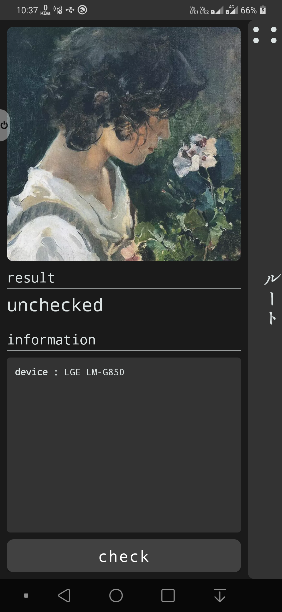
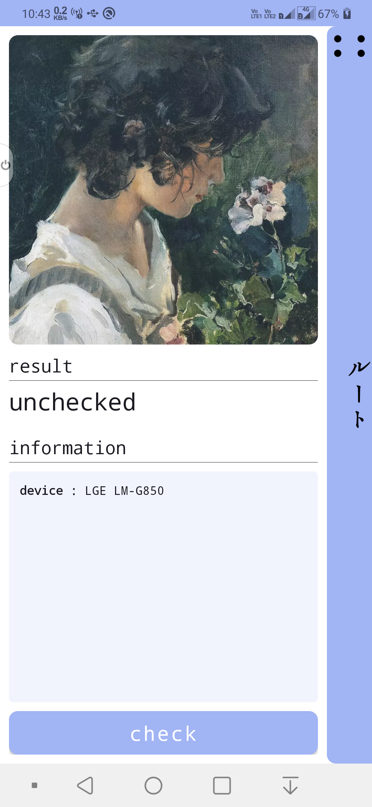
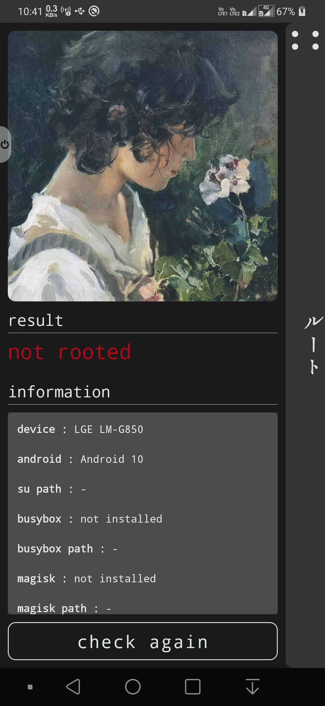

# rutodesu

Check whether your device is rooted or not with one tap.

rutodesu is available on the Google Play Store.  

We hope this app serves you well.

Special Thanks to [rootbeer](https://github.com/scottyab/rootbeer).

rutodesu is developed by Arupakaman Studios.
Arupakaman Studios is a group of independent developers working on various applications and services.

You can send us your feedback and app suggestions via email.

## Contact Us

Contact us at: arupakamanstudios[AT]gmail[DOT]com

## Licensing

rutodesu is licensed under the [MIT License.](LICENSE)